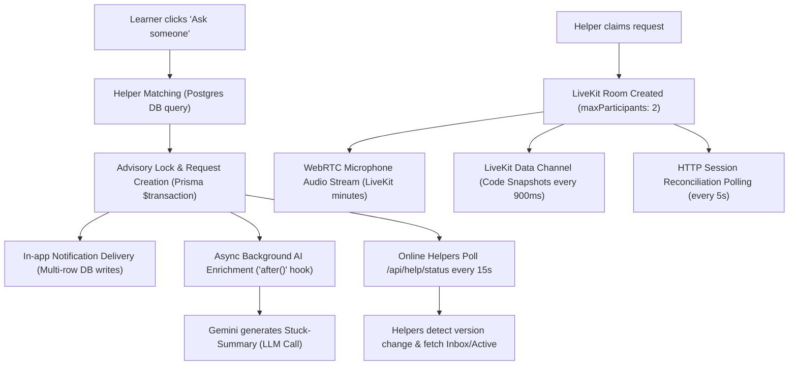

# Cost Analysis, Unit Economics, and Architecture Evaluation

This document outlines all financial costs (metered external APIs), infrastructure costs (serverless invocations, database load, and compute), unit economics per user flow, and an architectural evaluation of replacing the voice stack with OpenAI's Live / Realtime Speech-to-Speech API.

---

## 1. Executive Summary & Cost Hierarchy

The primary cost drivers in Trailgrad fall into three tiers:

1. **High-Impact Metered Voice & Media (Largest Cost Driver ~75%):**
   * **Deepgram (Streaming STT + TTS):** Billed continuously per candidate speech minute and character synthesized.
   * **LiveKit Cloud:** Billed per participant-minute across AI interview rooms and peer help rooms.
2. **High-Frequency Code Executions:**
   * **Judge0 CE (RapidAPI):** Billed per submission when candidates run and test code.
   * **Vercel Sandbox (`@vercel/sandbox`):** Spins up dedicated Firecracker microVMs per Core Technical run.
3. **High-Frequency HTTP Polling (Infrastructure & DB Load):**
   * **1.5s Voice Interview Polling:** ~1,200 serverless invocations and DB reads per 30-minute interview.
   * **15s Global Workspace Help Polling:** ~240,000 invocations/hour for 1,000 active learners checking for help requests.
   * **5s Call Reconciliation Polling:** 12 calls/minute per user during live peer help sessions.

---

## 2. Comprehensive Service & API Pricing Matrix

| Service / Layer | Model / Tier | Unit Pricing Rate | Role in Application |
| :--- | :--- | :--- | :--- |
| **Judge0 CE** (RapidAPI) | RapidAPI Tiers | • **Free:** 50 runs/day • **Pro (\$10/mo):** 10,000 runs (~**\$0.001 / run**) • **Ultra (\$35/mo):** 50,000 runs (~**\$0.0007 / run**) • *Self-hosted alternative:* ~**\$10–\$20/mo flat VPS** | DSA practice runs & interview coding challenges (`src/app/api/code/run/route.ts`) |
| **Vercel Sandbox** | Firecracker MicroVMs (`@vercel/sandbox`) | • ~**\$0.00004 / vCPU-second** (~**\$0.0002–\$0.001 / run**) | Isolated execution for Core Technical code challenges (`vercel-sandbox-executor.ts`) |
| **Deepgram STT** | Streaming (`flux-general-en`) | • **\$0.0059 – \$0.0077 / audio minute** | Real-time candidate speech-to-text during voice interviews (`agent/config.py`) |
| **Deepgram TTS** | `aura-asteria-en` (Aura-1) | • **\$0.015 / 1,000 characters** (~**\$0.000015 / char**) | Maya voice synthesis in interviews & workspace welcome (`src/app/api/voice/speak/route.ts`) |
| **LiveKit Cloud** | WebRTC Audio & Data Channels | • **\$0.0015 / participant-minute** • **\$0.10 / GB egress bandwidth** *(Free tier: 10,000 participant-mins/mo)* | 1. AI Voice interview room (Agent + User) 2. Peer-to-peer help room (Learner + Helper) |
| **Groq** | `openai/gpt-oss-20b` / Llama | • ~**\$0.10 / 1M input tokens** • ~**\$0.20 / 1M output tokens** | Per-turn low-latency conversational interview decision loop (`src/app/api/interview/decide/route.ts`) |
| **Google Gemini** | `gemini-flash-lite` `gemini-flash` `gemini-embedding` | • **Flash-Lite:** \$0.075 / 1M in, \$0.30 / 1M out • **Flash:** \$0.10 / 1M in, \$0.40 / 1M out • **PDF Vision:** ~258 tokens/page (~\$0.00003/page) • **Embeddings:** \$0.02 / 1M chars | Resume parsing, Stuck-summary, interview rubric grading, practice feedback evaluations |
| **Upstash Redis** | Serverless Redis | • **\$0.20 / 100,000 commands** *(Free tier: 10,000 commands/day)* | Distributed locks, rate-limit policies (`RATE_LIMIT_POLICIES`) |
| **Vercel Functions** | Serverless Compute | • **\$2.00 / 1M invocations** (beyond 1M included on Pro) • **\$0.000018 / GB-second** compute | Next.js API routes (`/api/interview`, `/api/help/status`, etc.) |
| **Resend** | Transactional Email | • **Free:** 3,000 emails/mo • **Pro (\$20/mo):** 50,000 emails/mo | Teacher daily encouragement emails (`teacher-notification.service.ts`) |
| **Clerk** | Authentication | • **Free:** up to 10,000 MAU • **Pro:** \$25/mo base + \$0.02 / MAU over 10k | User authentication & sessions |

---

## 3. Unit Economics by User Flow

### A. One 30-Minute AI Voice Interview: ≈ \$0.32
* **LiveKit (Candidate + Python Agent):** 60 participant-minutes = **\$0.09**
* **Deepgram Streaming STT:** ~15 minutes active candidate speech = **\$0.09 – \$0.12**
* **Deepgram Aura-2 TTS:** ~8,000 characters generated = **\$0.12**
* **Groq Decider (25 turns):** ~25k tokens = **\$0.005**
* **Final Rubric Evaluation (Gemini Flash):** Full transcript evaluation = **\$0.003**
* **1.5s Polling (1,200 serverless hits):** = **~\$0.003**
> **Total per 30-minute interview: ≈ \$0.31 – \$0.35**

---

### B. One 10-Minute Peer-Help Call (Two Mates): ≈ \$0.032
* **LiveKit Room (2 Human Participants):** 2 participants × 10 mins = 20 participant minutes = **\$0.03**
* **LiveKit Data Channel (Snapshots every 900ms):** ~650 packets ≈ small data payload = **<\$0.001**
* **AI Stuck-Summary (Gemini Flash-Lite):** Single background generation = **~\$0.001**
* **5s Session Reconciliation Polling:** 120 API requests = **<\$0.001**
> **Total per Peer Help Call: ≈ \$0.032**  
> *(Significantly cheaper than AI interviews because real humans speak directly without STT, TTS, or LLM generation).*

---

### C. 1,000 Code Executions
* **Judge0 (DSA Workspace):**
  * RapidAPI Pro: **\$1.00**
  * Self-Hosted VPS (\$15/mo server handling 50k runs): **\$0.30**
* **Vercel Sandbox (Core Technical microVMs):**
  * 1,000 microVM executions (~3s each): **\$0.15 – \$0.30**

---

### D. Resume Onboarding & Resume Roast: ≈ \$0.005 – \$0.015
* **Visual PDF Extraction (Gemini Multimodal Vision):** 2-page PDF = **<\$0.001**
* **Structured Extraction & Profile Analysis (Gemini):** ~4,000 tokens = **~\$0.001**
* **Interview Kit Generation:** ~5,000 tokens = **~\$0.002**
* **Resume Roast Generation:** ~4,000 tokens = **~\$0.001**
* **Optional Voice Readout (Deepgram TTS):** ~600 chars = **~\$0.009**

---

## 4. The "Ask Someone" Cost Breakdown

When a learner clicks **"Ask someone"**, the following cascade executes:

1. **Database & Rate Limiting:** Enforces locks in Upstash Redis and Postgres to ensure one live request per person.
2. **AI Stuck-Summary Generation:** An asynchronous `after()` task invokes Gemini to analyze learner code, errors, and failing tests.
3. **Polling Fan-out:** Every online learner/helper has an active 15s interval polling `/api/help/status`. When the status version updates, they pull `/api/help/inbox`.
4. **Live WebRTC Call:** Once claimed, both participants enter a LiveKit audio room with 900ms workspace data sync.

---

## 5. Infrastructure Load: Polling vs. Push

| Polling Location | File Reference | Interval | Volume per 100 Users | Monthly Vercel Function Cost |
| :--- | :--- | :--- | :--- | :--- |
| **Voice Interview Client** | `src/features/interviews/ui/voice/voice-interview-client.tsx#L87` | **1.5s** | 240,000 req/hr | **~\$34.50 / mo** |
| **Global Help Status** | `src/features/peer-help/ui/workspace-help-polling.tsx#L18` | **15s** | 24,000 req/hr | **~\$3.50 / mo** |
| **Peer Call Reconciliation** | `src/features/peer-help/ui/help-call.tsx#L282` | **5s** | 72,000 req/hr | **~\$10.30 / mo** |

*Note: In addition to serverless function charges, high-frequency polling can exhaust database connection pools in serverless environments unless connection pooling (e.g., PgBouncer / Prisma Accelerate / Neon pooling) is strictly configured.*

---

## 6. Architecture Evaluation: OpenAI Live / Realtime API

### Could we replace the current voice stack with OpenAI Live?
**Yes, technically feasible, but economically prohibitive.**

### What it eliminates from your current stack:
* **Deepgram STT (`flux-general-en`):** The live model accepts raw audio directly over WebSockets/WebRTC.
* **Deepgram TTS (`aura-asteria-en`):** The live model streams native audio tokens back.
* **Groq LLM Decider:** The live model acts as both decider and speaker simultaneously.
* **Turn-taking & Silence Delays:** Native Voice Activity Detection (VAD) handles interruptions and candidate pauses automatically.
* **Python Agent Server (`agent/agent.py`):** Browser can connect directly to OpenAI via WebRTC using ephemeral tokens.

### What MUST remain:
* **LiveKit for Peer-to-Peer Help Calls:** The human-to-human call between two mates still requires WebRTC room routing and 900ms data channel code synchronization.
* **Judge0 & Vercel Sandboxes:** Code execution cannot be handled by an audio model.
* **Rubric Grading & Resume Parsing:** Post-interview scoring and PDF vision remain on Gemini.

### Cost Comparison: Current Stack vs. OpenAI Live

| Metric | Current Stack (LiveKit + Deepgram + Groq) | OpenAI Live / Realtime API |
| :--- | :--- | :--- |
| **Cost per 30-min interview** | **~\$0.32** | **~\$3.60 – \$6.00** |
| **Cost Difference** | **Baseline (1x)** | **12x to 18x more expensive** |
| **Cost for 1,000 interviews** | **\$320** | **\$3,600 – \$6,000** |
| **End-to-End Latency** | ~800ms – 1200ms | ~300ms – 400ms |
| **Conversational Realism** | Good (standard turn-taking) | Outstanding (human-like breathing, tone, natural interruptions) |
| **State Machine Control** | **Deterministic:** Strict stages, rubric tracking, and question delivery enforced in `/api/interview/decide` | **Probabilistic:** Requires complex client-side tool calling; prone to drifting from rubrics |

> **Verdict:**  
> OpenAI Live is impractical for a high-volume learning platform unless charging high premium fees (\$20–\$50 per session). The current modular stack (LiveKit + Deepgram + Groq) is the **industry-standard architecture** for balancing low latency with viable unit economics.

---

## 7. Actionable Cost Optimization Recommendations

1. **Replace 1.5s Voice Polling with Server-Sent Events (SSE) or LiveKit Data Channels:**
   * Instead of 1,200 HTTP calls per interview, push state changes down the established LiveKit data channel or a lightweight SSE connection. This cuts millions of serverless invocations and database queries.
2. **Back Off Workspace Help Polling:**
   * Increase `POLL_MS` in `workspace-help-polling.tsx` from 15s to 45s or 60s when the tab is unfocused or idle.
3. **Self-Host Judge0 CE on a \$15–\$20/mo VPS:**
   * Eliminates RapidAPI per-submission billing entirely, providing unlimited code executions at fixed monthly cost.
4. **Enforce Client-Side Debouncing on "Run Code":**
   * Introduce a 3–5 second cooldown before allowing repeated test runs to prevent accidental spamming of execution engines.
5. **Keep `INTERVIEW_DAILY_LIMIT=2`:**
   * Retaining the daily interview limit protects against runaway Deepgram and LiveKit media charges.
