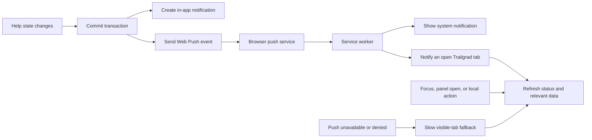

# Important Enhancements

Last verified: September 15, 2026

This document records the highest-priority product quality, reliability, and cost
improvements for Resume Roast, notifications, and client synchronization. Pricing and
free-tier limits are point-in-time facts, not guarantees that the system will remain
free at every future scale.

## 1. Executive decision

Trailgrad can remove nearly all recurring notification polling and can realistically
operate within free infrastructure allowances at its current scale. The recommended
design is:

1. Use native Web Push for time-sensitive, cross-user peer-help events.
2. Refresh application state when a push arrives, the window regains focus, a relevant
   panel opens, or the user performs a state-changing action.
3. Retain a slow, visible-tab fallback for users who do not grant notification
   permission.
4. Treat interview state synchronization as a separate system. Gemini Live now
   refreshes saved state after actions and uses a visible-tab recovery fallback;
   confirm every interview path before reducing that fallback further.

This design has no new required paid vendor. It minimizes Vercel invocations and lets
Neon scale to zero more often, but `$0 forever` cannot be guaranteed because usage and
provider limits can change.

## 2. Current behavior

Trailgrad currently has three distinct polling paths. They must not be estimated or
migrated as one feature.

| System | Current behavior | Purpose | Main concern |
| --- | --- | --- | --- |
| Peer help | Requests `/api/help/status` every 15 seconds while the page is visible; fetches inbox and active state after a change | Detect requests, claims, cancellations, and call state | High recurring invocation and database load |
| General notifications | Polls `/api/notifications/status` with 60-second, 120-second, then 5-minute backoff | Update the notification badge and inbox | Already substantially optimized; lower priority |
| Voice interviews | Refreshes after saved turns and reconnection, plus visible-tab recovery checks at 5–30 seconds depending on state | Synchronize transcript, progress, questions, and completion | Interview-mode verification is still needed |

Relevant implementations:

- `src/features/peer-help/ui/workspace-help-polling.tsx`
- `src/features/notifications/ui/workspace-notification-polling.tsx`
- `src/features/interviews/ui/voice/voice-interview-client.tsx`
- `src/app/api/help/status/handler.ts`

The peer-help status request is not only a static notification read. It also invokes
best-effort help reconciliation before returning a version token. Frequent polling can
therefore cause more work than the request count alone suggests.

## 3. Corrected traffic and cost assumptions

### Peer-help polling volume

At one visible hour per user per day:

```text
60 minutes x 4 polls/minute = 240 requests/user/day
240 x 30 days = 7,200 requests/user/month
7,200 x 1,000 users = 7,200,000 requests/month
```

The estimate of 20,000 monthly requests for 1,000 users is not a safe expectation. It
would allow only 20 checks per user per month. Even 20 action-driven refreshes per user
per day would produce approximately 600,000 requests per month.

### Current provider allowances

These limits were verified on September 15, 2026 and must be rechecked before making
financial commitments:

| Provider | Relevant current allowance | Important qualification |
| --- | --- | --- |
| Vercel Hobby | First 1,000,000 Fluid Compute function invocations, 4 active CPU-hours, and 360 GB-hours provisioned memory | Hobby does not bill normal overages; the project may be paused after limits are exceeded |
| Vercel Pro | First 1,000,000 requests included; additional invocations currently have an effective rate of $0.60 per million | CPU and provisioned-memory usage are separate costs |
| Neon Free | 100 CU-hours per project per month, 0.5 GB storage, and scale-to-zero after five inactive minutes | Continuous polling can repeatedly keep or wake compute active |
| Ably Free | 200 concurrent connections, 500 messages/second, and 6 million messages/month | Positioned as a proof-of-concept package, not a production guarantee |
| Pusher Sandbox | 100 concurrent connections and 200,000 messages/day | Capacity is limited by simultaneous connections even when message volume is low |

Official references:

- [Vercel Fluid Compute pricing](https://vercel.com/docs/functions/usage-and-pricing)
- [Vercel Hobby limits](https://vercel.com/docs/plans/hobby)
- [Neon pricing](https://neon.com/pricing)
- [Ably pricing](https://ably.com/pricing)
- [Pusher Channels pricing](https://pusher.com/channels/pricing/)

The older `$2 per million Vercel invocations` assumption should not be used for current
planning. At 7.2 million total invocations, 6.2 million are beyond the first million;
at the current Pro invocation rate that component is approximately $3.72, before plan,
CPU, memory, database, bandwidth, and any other usage costs.

## 4. Recommended notification architecture



### Events that should trigger push

- A new help request becomes eligible for a helper.
- A helper claims the learner's request.
- A request is cancelled, expires, or is reassigned.
- A peer-help call becomes ready or ends unexpectedly.
- Another genuinely time-sensitive notification requires immediate attention.

Routine badge changes and historical updates do not need an operating-system push.

### Client refresh triggers

The client should refresh the compact status and then fetch full data only when needed:

- A push message is received.
- The browser window regains focus or becomes visible.
- The user opens the notification or Trailmate panel.
- The user creates, claims, cancels, completes, or marks an item as read.
- A local `WORKSPACE_HELP_CHANGED_EVENT` or
  `WORKSPACE_NOTIFICATIONS_CHANGED_EVENT` is dispatched.
- A slow fallback timer fires for a visible client without usable Web Push.

### Fallback policy

Web Push requires user permission and cannot be the only consistency mechanism.

- Suggested fallback interval: 2–5 minutes while visible.
- Do not poll while the document is hidden.
- Refresh immediately after focus or visibility restoration.
- Keep explicit manual refresh behavior available.
- Back off after unchanged responses and transient failures.

This fallback does not provide 15-second responsiveness to users who deny push. The UI
should explain that enabling notifications provides immediate help alerts.

## 5. Native Web Push implementation requirements

Native Web Push does not require Pusher or Ably, but it is not infrastructure-free.
Trailgrad must add:

1. One VAPID public/private key pair stored through deployment secrets.
2. A service worker that receives push events, displays notifications, handles clicks,
   and informs open application windows.
3. A user-initiated permission and subscription flow. Do not show the permission prompt
   automatically on first page load.
4. A database table for each user's push endpoint, encryption keys, browser/device
   metadata, creation time, and last successful delivery.
5. Authenticated subscribe and unsubscribe endpoints with CSRF protection.
6. Server-side push delivery after the related database transaction commits.
7. Cleanup for expired subscriptions when a push service returns `404` or `410`.
8. Idempotency and deduplication so retries do not generate repeated notifications.
9. Generic lock-screen wording that does not expose private resume, interview, or code
   content.
10. Delivery logging and metrics without storing sensitive push payloads.

Web Push removes continuous polling; it does not remove every server invocation or
database query. The application still creates notifications, selects recipients, reads
subscriptions, sends payloads, and updates or removes invalid subscriptions.

Browser considerations:

- Users must explicitly opt in.
- A service worker and secure HTTPS origin are required outside localhost.
- iPhone and iPad Web Push requires a supported Home Screen web app.
- Delivery timing is controlled partly by the browser and operating system.
- Safari requires received pushes to result in a visible notification; silent push
  should not be relied upon as a universal refresh channel.

References:

- [MDN Push API](https://developer.mozilla.org/en-US/docs/Web/API/Push_API)
- [Apple Web Push documentation](https://developer.apple.com/documentation/usernotifications/sending-web-push-notifications-in-web-apps-and-browsers)
- [Web Push server and VAPID overview](https://web.dev/articles/codelab-notifications-push-server)

## 6. Why action-and-focus-only refresh is insufficient

Removing the timer and checking only after local actions is cheap but changes product
behavior:

- A helper reading a page may never learn that another user requested help.
- A learner may not learn that a helper accepted until they interact with the page.
- Expiry and cancellation state can remain stale.
- Cross-user browser events cannot be delivered by local JavaScript events alone.

Action and focus refreshes are valuable consistency paths, but time-sensitive peer help
also needs Web Push, hosted realtime, or a polling fallback.

## 7. Hosted realtime alternative

Ably or Pusher can replace polling with WebSocket events and provide a simpler path to
instant in-app state updates. This is appropriate if notification permission friction
is unacceptable.

Trade-offs:

- Faster implementation of authenticated channels and reconnect behavior.
- Better foreground in-app event semantics than system notifications.
- A new vendor, SDK, account, operational dependency, and privacy review.
- Free-tier concurrent connection limits can be reached before total-user limits.
- Background delivery is not equivalent to operating-system Web Push.
- Free-tier terms and capacities can change.

If a hosted service is selected, Ably currently offers more free concurrent connections
than Pusher. Neither should be described as guaranteed free forever.

## 8. Interview polling is a separate enhancement

The Gemini Live interview client no longer has a global 1.5-second interval.
It reads the durable session on entry, after a saved answer or skip, when Gemini
reconnects, and when the visible tab regains focus or network. A single in-flight
read coalesces recovery checks and queues a fresh read after a saved action.
The fallback retries after 5 seconds until the first session loads, checks every
10 seconds while connecting, and every 30 seconds while live. It stops in hidden
tabs and after the session ends. Gemini continues to handle live audio and
transcription; LiveKit remains in Trailmate.

Before reducing the fallback further, verify voice, typed, resume, fundamentals,
DSA, completion, and reconnect flows against the saved session and check request
volume during active interviews.

Long-lived Server-Sent Events are not automatically the cheapest option on Vercel:
provisioned memory remains allocated while a function waits on I/O. Short
event-triggered reconciliation fits the current Gemini Live architecture.

## 9. Delivery plan

### Phase 1: Measure and reduce unnecessary work

- Record request counts for help status, general notification status, full inbox reads,
  active engagement reads, and interview session reads.
- Record the percentage of status checks that detect a change.
- Confirm Neon compute, Vercel invocation, CPU, and memory baselines.
- Ensure all polling stops in hidden tabs.
- Separate maintenance/reconciliation from the hot `/api/help/status` read where safe.

### Phase 2: Add Web Push

- Add subscription persistence and authenticated management endpoints.
- Add service worker registration and a user-initiated enable-notifications control.
- Send pushes for the peer-help lifecycle events listed above.
- Refresh open application tabs after receiving a push.
- Add invalid-subscription cleanup, deduplication, logging, and rate limits.

### Phase 3: Retire fast peer-help polling

- Replace the 15-second interval with push, focus, panel-open, local-action, and event
  refresh triggers.
- Add a 2–5 minute visible-only fallback for users without push.
- Monitor missed-event reports and time-to-notification.
- Tune or remove the fallback only after delivery reliability is demonstrated.

### Phase 4: Verify interview synchronization

- Check saved turns, question progression, completion, and reconnect in every
  supported interview mode with the reduced recovery checks.
- Measure active-interview request volume and missed updates before reducing
  the fallback further.

## 10. Acceptance criteria

The notification enhancement is complete when:

- A subscribed eligible helper receives a new-request alert without recurring polling.
- A subscribed learner receives claim, cancellation, expiry, and call-ready updates.
- Clicking a system notification opens the correct authenticated Trailgrad destination.
- An already-open tab refreshes promptly after the push is received.
- Users who deny or lack Web Push still converge through focus, action, panel-open, and
  slow visible-only fallback refreshes.
- No notification timer runs while the page is hidden.
- Duplicate server attempts do not create duplicate visible alerts.
- Expired subscriptions are removed safely.
- Push payloads do not expose sensitive user content on a lock screen.
- Peer-help state remains correct after missed pushes, network loss, sleep, and reconnect.
- Vercel and Neon usage dashboards show a material reduction from the pre-migration
  baseline.

The interview synchronization enhancement is complete only when the new recovery
cadence is confirmed not to regress transcript persistence, question progression,
completion, audio teardown, reconnect behavior, or report generation.

## 11. Decision summary

| Goal | Recommended choice |
| --- | --- |
| Lowest recurring cost with background alerts | Native Web Push plus event-driven refresh |
| Instant foreground updates with the least custom realtime infrastructure | Ably or Pusher, subject to free-tier limits |
| Fastest temporary reduction | Increase polling intervals, stop hidden-tab polling, and refresh on focus/actions |
| Safest long-term design | Web Push for urgent events, authoritative refresh for consistency, and a slow permission-denied fallback |

The financial target should be phrased as **“designed to stay within current free-tier
limits at expected usage”**, not **“guaranteed $0 forever.”**

## 12. Resume Roast quality and reliability

Resume Roast has several user-visible issues that should be addressed as one cohesive
experience rather than as independent cosmetic bugs.

### Reported problems

- James sounds different from the James used in resume and HR interviews.
- Speech pacing has varied between noticeably too slow and too fast.
- Generated feedback can appear on screen without James speaking the final roast.
- Some sessions stop after the three targeting questions instead of transitioning into
  the final roast.
- Analysis can fail and leave the user with only a generic retry action.
- The experience does not always feel smooth during analysis and stage transitions.
- The roast is useful but sometimes too neutral; it should be funnier without becoming
  cruel, discriminatory, or less actionable.
- The resume preview and supporting surfaces have insufficient contrast in light theme.

### Recommended state model

Resume Roast should have explicit, observable stages:

```text
resume_ready
  -> collecting_target
  -> analysis_queued
  -> analyzing
  -> report_ready
  -> final_roast_speaking
  -> complete
```

Each transition should be idempotent and persisted. The interface should never display
`Complete` merely because the report JSON exists if the required final spoken turn has
not been queued or intentionally skipped. Conversely, a TTS playback failure must not
erase or block access to a successfully generated written report.

### Voice consistency

- Define James once in a shared persona/voice configuration used by Resume Roast,
  resume interviews, and HR interviews.
- Centralize the provider, model, voice identifier, speaking rate, style instructions,
  and pronunciation rules instead of duplicating them per feature.
- Do not silently fall back to a different system voice. If the preferred voice is
  unavailable, show a recoverable audio error while preserving the transcript.
- Log the resolved provider, voice ID, rate, and fallback reason for each spoken turn.
- Add an automated configuration test proving that all James entry points resolve to
  the same voice profile.

### Pacing and smooth playback

- Use one moderate default speaking rate for James across features.
- Keep punctuation conversational; excessive commas, ellipses, and em dashes can create
  unnatural pauses in synthesized speech.
- Split the final roast into natural sentences or short paragraphs, while preventing
  audible gaps and overlapping chunks.
- Prebuffer the next audio chunk before the current chunk ends.
- Disable duplicate play requests and cancel stale audio when a session is retried.
- Show clear `Preparing`, `James is speaking`, `Replay`, and recoverable audio-error
  states.
- Measure generation-to-first-audio latency, playback interruptions, and TTS failures.

### Guaranteed final roast delivery

- Generate the structured report and the spoken summary from the same authoritative
  analysis result.
- Persist a final James turn before initiating playback.
- Queue speech only after the final turn has been committed successfully.
- Mark speech as delivered only after playback completion, not when synthesis begins.
- Provide a visible `Play James's roast` or `Replay roast` control even when autoplay is
  blocked by the browser.
- On refresh or reconnect, recover an unfinished final turn without rerunning the entire
  analysis unnecessarily.
- Never allow the three targeting questions to be interpreted as the completed roast.

### Analysis reliability

- Validate targeting answers before starting analysis and provide field-specific errors.
- Give analysis requests an idempotency key so retrying cannot create divergent reports.
- Separate retryable provider/network failures from invalid model output and permanent
  input errors.
- Validate structured model output and make one bounded repair attempt when safe.
- Preserve the selected role, company type, seniority, and resume between retries.
- Use a bounded timeout and expose a useful error code in server logs without leaking
  internal details to the user.
- Keep the last valid report available if a later speech or refresh operation fails.
- Add tests for timeout, malformed output, provider failure, duplicate retry, refresh
  during analysis, and successful recovery.

### Humor and feedback quality

The intended tone is a sharp but supportive career coach: joke, explain, and fix.

Every major criticism should contain:

1. A concise, resume-specific punchline.
2. The factual evidence from the resume that motivated it.
3. The hiring impact for the selected role and company type.
4. A concrete rewrite or next action.

Humor should target the document, repetition, vagueness, formatting, and missing
evidence—not the candidate's identity, background, appearance, protected traits, or
personal circumstances. Avoid generic joke templates that repeat across reports. Keep
the spoken roast shorter and punchier than the detailed written analysis.

### Light-theme requirements

- Replace hard-coded dark preview colors with semantic theme tokens.
- Ensure resume body text, metadata, chips, borders, disabled controls, transcript
  bubbles, and scrollbars meet WCAG AA contrast in light mode.
- Preserve the source resume's hierarchy without rendering its text as faint gray on a
  dark embedded page inside an otherwise light interface.
- Check hover, focus, selected, error, loading, and disabled states in both themes.
- Add screenshots for the targeting, analyzing, failed, report-ready, and speaking
  stages at desktop and mobile widths.
- Test theme switching without remounting or losing the current roast session.

### Resume Roast acceptance criteria

- James resolves to the same configured voice in Resume Roast, resume interviews, and
  HR interviews.
- Speech is understandable at a consistent moderate rate and contains no unintended
  long pauses or overlapping playback.
- After three valid targeting answers, every successful analysis reaches a written
  report and a persisted final James turn.
- James speaks the final roast automatically when browser policy allows it; otherwise a
  prominent manual play control is available.
- Refreshing during analysis or playback recovers the correct stage.
- Retrying a failed analysis does not duplicate turns or create conflicting reports.
- At least one resume-specific, safe punchline accompanies each major weakness while
  the advice remains concrete and accurate.
- All Resume Roast screens remain readable and visually coherent in light and dark
  themes.
